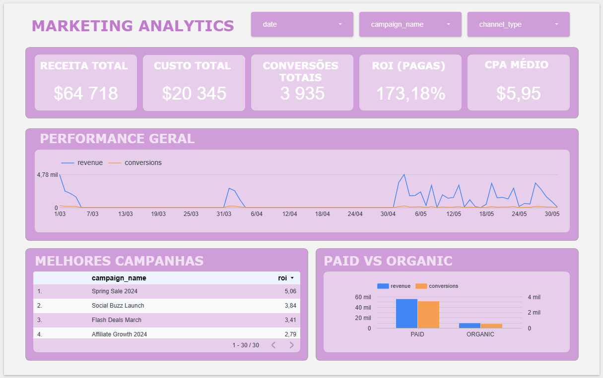

```markdown

# Marketing Analytics Project

## Objective
Analyze the performance of marketing campaigns (paid and organic), identifying patterns, efficiency, and optimization opportunities to support data-driven decisions.

## Dataset
The dataset includes marketing campaign data such as:

- campaign_id
- campaign_name
- date
- impressions
- clicks
- conversions
- cost
- revenue

Additional metrics were created, including CTR, CPA, ROI, and Conversion Rate.

## Tools Used

- Excel → data cleaning and preparation  
- SQL (SQLite) → data analysis and aggregation  
- Looker Studio → dashboard and visualization  

## Methodology

1. Data cleaning and preparation in Excel  
2. Importing data into SQLite and performing SQL analysis  
3. Creating analytical queries and metrics  
4. Building an interactive dashboard in Looker Studio  
5. Extracting insights and business recommendations  

## Dashboard

Access the interactive dashboard:
[Ver Dashboard](https://lookerstudio.google.com/s/td8g28E0cKQ)




## Key Insights

- Overall campaign performance is positive, with revenue exceeding costs  
- Organic campaigns contribute significantly to total revenue  
- Efficiency (ROI) is not directly driven by investment size  
- There is room for optimization in the acquisition funnel  

## Recommendations

- Increase investment in organic campaigns strategically  
- Analyze top-performing campaigns to replicate success factors  
- Improve conversion from impressions to clicks (CTR optimization)  

## Project Structure

```text
marketing-analytics/
   dashboard/
   data/
   database/
   docs/
   excel/
   images/
   sql/
   README.md